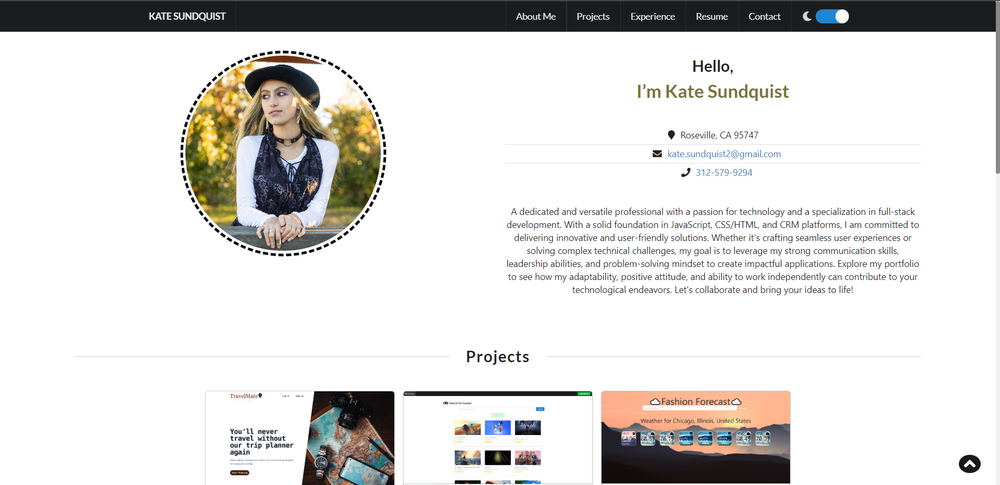
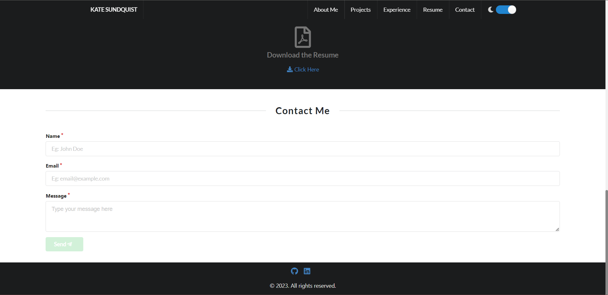

# mi-portfolio

[](https://opensource.org/licenses/MIT)

My React Portfolio


## Description

This is an application that is used to showcase my portfolio, resume and projects that I have worked on. I wanted to be able to show employers/other developers to work together and collaborate on future projects. There will be a 'contact me' for future and further communication. I will also link my "LinkedIn" and "GitHub" on the footer of my application.

## User Story
```
AS AN employer looking for candidates with experience building single-page applications
I WANT to view a potential employee's deployed React portfolio of work samples
SO THAT I can assess whether they're a good candidate for an open position
```

## Technologies Used

React.js, JavaScript, JSON, React-Bootstrap, CSS, HTML

This project was bootstrapped with [Create React App](https://github.com/facebook/create-react-app).


## Installation
```
npm install
npm start
Open http://localhost:3000 on browser to view
```

## Visual






## Links

[GitHub Repo](https://github.com/kitkatt17/mi-portfolio)

[Deployed Link](https://kitkatt17.github.io/mi-portfolio/)


## License

[](https://opensource.org/licenses/MIT)

[MIT License](https://opensource.org/license/mit-0/)

For the full text of this license, please click on the link provided.